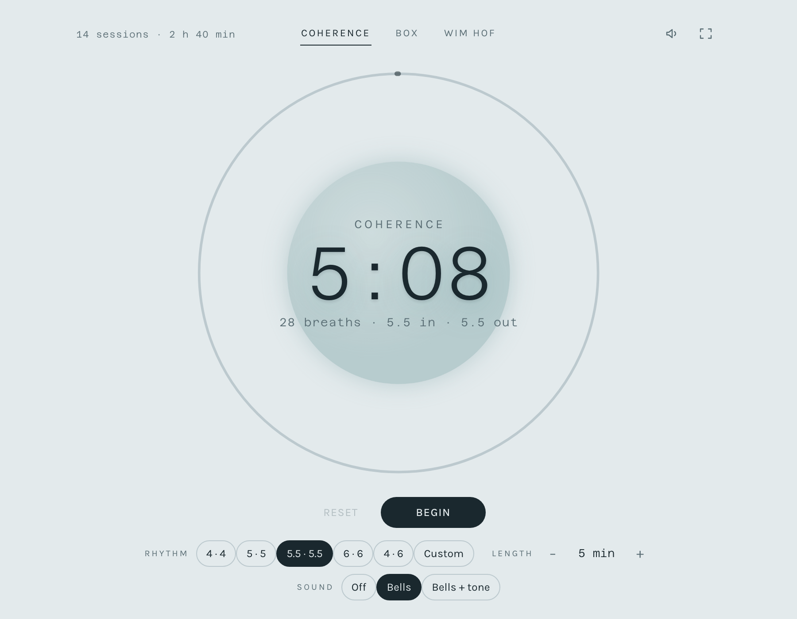
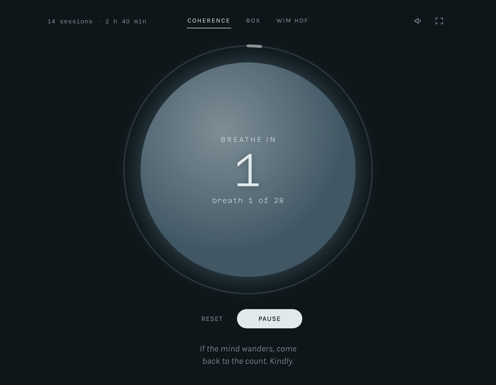
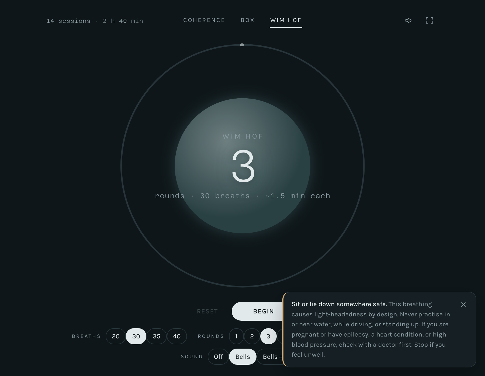
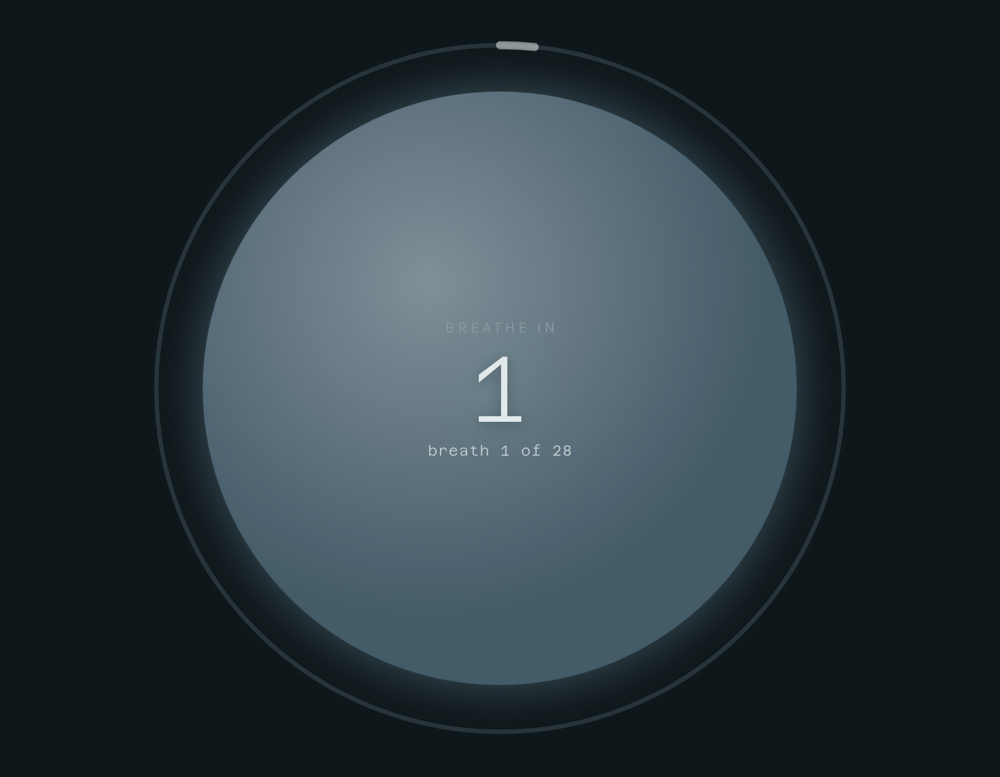
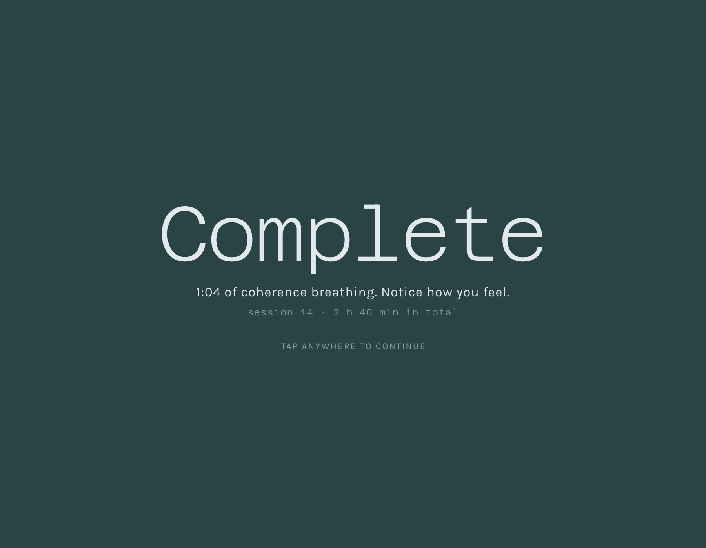

# Breathe

A quiet breathing pacer: coherence breathing, box breathing, and the Wim Hof method.

**Live at [ryanarnaudin.com/sites/breathe/](https://ryanarnaudin.com/sites/breathe/)**

Two files, no dependencies, no build step, no network. It is a guided timer rather
than a reading page — you set a length, press Begin, and follow an orb that swells
and settles with the breath.



## Use it

Open [ryanarnaudin.com/sites/breathe/](https://ryanarnaudin.com/sites/breathe/),
pick a practice, and press Begin.

To run it locally instead, open `index.html` in a browser — double-click works,
because the fonts are embedded rather than fetched. Keep `fonts.css` next to it.
Or serve the folder if you prefer a URL:

```bash
python3 -m http.server 8000
```

## What it does

- **Three practices** — coherence, box, and Wim Hof — each with its own controls.
- **A pacing orb** that grows on the inhale and shrinks on the exhale, ringed by a
  progress arc. The orb shifts color by phase: blue while breathing in, green
  while breathing out, sand while holding.
- **Whole breaths, always.** You set a total time and the app rounds up to the next
  complete cycle rather than cutting one short, so a five minute session at 5.5
  seconds in and out actually runs 28 breaths, or 5:08. The real figure is shown
  before you start.
- **Guidance that changes with the phase**, one line at a time, in the space the
  options leave behind once a session starts.
- **Synthesized sound.** No audio files — bells and an optional drifting tone are
  generated in the browser.
- **A session count** kept locally, shown in the header and on the closing screen.

Mid-session the options step aside for the guidance line. Both share one cell, so
the orb never moves when a session starts:



## The practices

### Coherence

Equal, slow breathing at five to six breaths a minute. The default of 5.5 seconds
in and 5.5 out is the common resonance rate; 4 in and 6 out lengthens the exhale
if you want the calming bias.

| Seconds in · out | What it gives |
|---|---|
| 4 · 4 | brisk, easy to hold |
| 5 · 5 | six breaths a minute |
| 5.5 · 5.5 | the default resonance rate |
| 6 · 6 | five breaths a minute |
| 4 · 6 | longer exhale |
| Custom | 1 to 20 seconds each side |

### Box

Four equal sides: in, hold, out, hold. Presets run 3, 4, 5, and 6 seconds. Custom
takes all four numbers separately, and a hold set to zero is skipped entirely, so
4 · 0 · 6 · 0 gives you a plain long-exhale pattern.

Both of the above take a session length from 1 minute up to an hour.

### Wim Hof

Rounds of rapid full breaths, then a retention hold on the empty lungs, then a
short recovery hold. Built against the protocol as transcribed in my notes:

> Do ~40 repetitions of the following breathing exercise: Max inhale (raise chest)
> and "let go" exhale (drop chest sharply). The let-go exhale can be thought of as
> a short "hah." If you're doing this correctly, after 20 to 30 reps you might feel
> loose, mild lightheadedness, and a little bit of tingling. The tingling is often
> felt in the hands first.

*From my reading notes, at Kindle location 1117.*

| Setting | Options |
|---|---|
| Breaths per round | 20, 30, 35, 40 |
| Rounds | 1, 2, 3, 4 |
| Pace | Slow (2.2s in, 1.8s out), Steady (1.7 / 1.3), Brisk (1.3 / 1.0) |

The retention is open-ended and counts up — it ends when you say so, by pressing
the button, tapping the orb, or hitting space. Each round's retention time is
reported on the closing screen. A 15 second recovery hold follows, then the next
round begins after a short rest.

## Safety

Wim Hof breathing causes light-headedness by design. The app says so up front, in
a dismissible notice that appears whenever you select that practice:



> Sit or lie down somewhere safe. This breathing causes light-headedness by design.
> Never practice in or near water, while driving, or standing up. If you are
> pregnant or have epilepsy, a heart condition, or high blood pressure, check with
> a doctor first. Stop if you feel unwell.

The notice is deliberately not remembered between visits. It reappears each time
you enter the practice from another one, or load the page into it, and stands down
on its own once a session starts. The mid-session guidance repeats the part that
matters while you are breathing.

This is a pacing tool, not medical advice.

## Focus mode

The expand icon, or `F`, hands the whole screen to the orb and takes everything
else out of the layout:



Move the mouse, tap, or press a key and the controls fade back for a second and a
half. While a session is running a reveal offers only Reset and Pause, plus the
sound and exit icons — the settings would only reset the session, so they stay
away until you do. It asks for real browser fullscreen too, and falls back to the
bare layout where that is refused, such as iOS Safari.

## Sound

Everything is generated with the Web Audio API; there are no audio files to load.

| Setting | What you hear |
|---|---|
| Off | nothing |
| Bells | a struck bowl at each phase change, pitched differently for in, out, and hold |
| Bells + tone | the bells, plus a low tone that rises with the inhale and falls with the exhale |

Wim Hof swaps the bells for breath-shaped sounds: a rising whoosh on each inhale,
a low "hah" on each exhale, and bowl strikes at the retention, the recovery, and
the end.

The speaker icon is a shortcut that flips between off and your last choice, so the
icon and the sound row can never disagree.

## Keyboard

| Key | Action |
|---|---|
| `Space` or `Enter` | Begin, pause, or end a Wim Hof retention |
| `F` | Focus mode |
| `M` | Mute, or restore the last sound setting |
| `R` | Reset |
| `Esc` | Dismiss the safety notice, otherwise leave focus mode |

## When a session ends



## Notes

- **Sound needs a gesture first.** Browsers will not let a page make noise until
  you interact with it, so audio is armed when you press Begin.
- **Sessions do not survive a reload.** Unlike the sibling
  [tea timer](https://github.com/arnaudin/tea-timer), only your settings and
  totals persist — a session in progress is lost if you refresh.
- **What is stored.** Practice, every per-practice setting, sound choice, focus
  preference, and the session log live in `localStorage` under `breathe.v1`.
  Nothing leaves the browser.
- **The screen stays awake** during a session where the Wake Lock API is available.
- **Offline.** Nothing is fetched at runtime. Both typefaces are subset to latin,
  embedded in `fonts.css` as data URIs, and carry a full variable weight axis.
  Verified working from `file://`, where a separate font request would be refused.
- **Browsers.** Modern evergreen only — it leans on `color-mix()` in OKLab and
  container queries, so roughly Safari 16.4+, Chrome 111+, Firefox 113+.
- **Themes.** Light and dark are both designed; the page follows your system
  setting.
- **Motion.** Under `prefers-reduced-motion` the glow, the closing animation, and
  the button lift are dropped. The orb still scales, since that motion *is* the
  pacer.
- **Centering.** The countdown is optically centered at runtime rather than by its
  box. Monospace digits have uneven side bearings, so at full size `10:00` sits
  almost 3px right of true center while `40` sits under a fifth of a pixel off. A
  fixed nudge would be wrong for nearly every value, so the ink is measured per
  string and the difference is corrected.

## Repo contents

| File | What it is |
|---|---|
| `index.html` | The whole application |
| `fonts.css` | Azeret Mono and Karla, subset and embedded as data URIs |
| `screenshots/` | Images used by this README |

## Deploying

The live copy is a manual copy. Both `index.html` and `fonts.css` are duplicated
into the personal site repo at `sites/breathe/`, where Jekyll passes them through
untouched because they have no front matter, and the page is listed from
`_data/experiments.yml`. Copy both files or the type falls back to system fonts.
After changing anything here, re-copy, or the two will drift.
